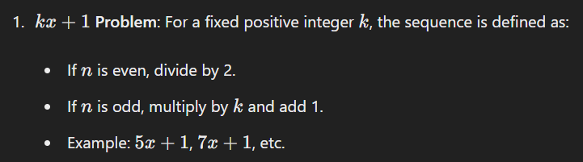
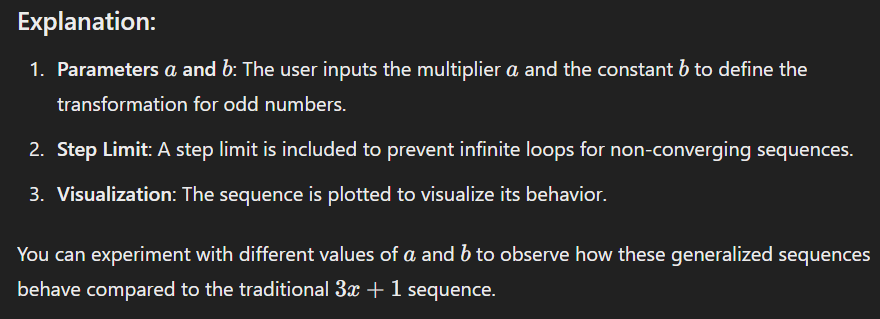

There are several similar expressions and variations to the 3x+1 problem, often referred to as generalized Collatz-type problems or generalized Collatz conjectures. These variations involve different linear transformations applied to the odd numbers.

Example Code for a Generalized Collatz Sequence:

Here's how you can modify the Python code to test a generalized Collatz sequence with parameters 
𝑎 and 𝑏;

